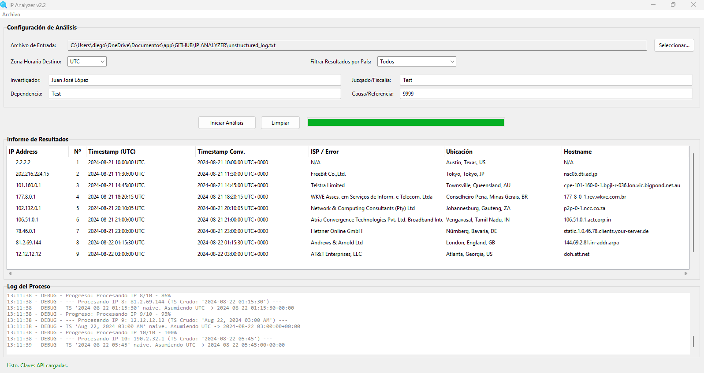
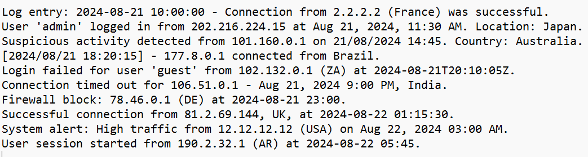
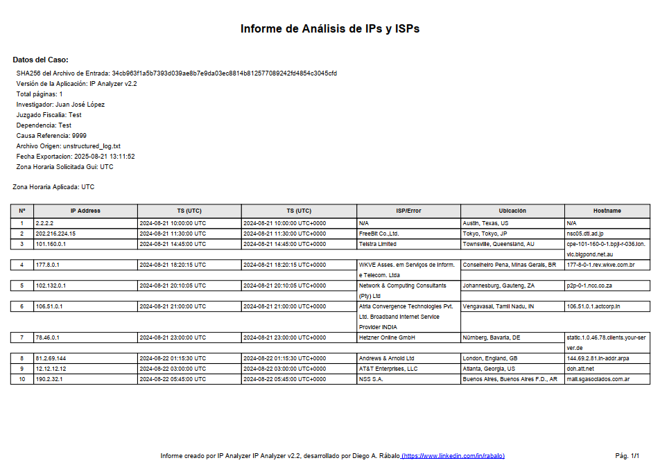

# IP Analyzer con IA v2.2 🤖


Herramienta de escritorio y línea de comandos para la extracción, análisis y enriquecimiento de direcciones IP desde diversas fuentes de texto. Utilizando la potencia de la IA de Google Gemini para la extracción de datos y la API de ipinfo.io para el enriquecimiento, esta aplicación permite a investigadores y analistas procesar grandes volúmenes de texto y generar informes detallados de manera eficiente.

## Apoya el Proyecto
Esta herramienta es un proyecto de código abierto. Si te resulta útil, considera apoyar su desarrollo con una donación.

[](https://www.paypal.com/donate/?hosted_button_id=6W8LAAFX9BN6E)

## Tabla de Contenidos
- [Características Destacadas](#características-destacadas)
- [Ideal para](#ideal-para)
- [Screenshots](#screenshots)
- [Ejemplo de Informe](#ejemplo-de-informe)
- [Instalación](#instalación)
- [Configuración](#configuración)
- [Uso](#uso)
- [Licencia](#licencia)
- [Créditos](#créditos)
- [Contacto y Soporte](#contacto-y-soporte)

## Características Destacadas
- 🧠 **Extracción Inteligente desde Texto No Estructurado:** Utiliza Google Gemini para analizar texto complejo y no estructurado, identificando y extrayendo con precisión direcciones IP y sus timestamps asociados. Funciona con una variedad de formatos de archivo (`.txt`, `.docx`, `.csv`, `.log`).
- 🌍 **Enriquecimiento de Datos:** Consulta la API de ipinfo.io para obtener información detallada de cada IP, incluyendo ISP, geolocalización (ciudad, región, país) y hostname.
- ⏰ **Conversión de Zona Horaria:** Parsea timestamps en diversos formatos y los convierte a la zona horaria que elijas (UTC por defecto).
- 📄 **Informes Mejorados:** Genera informes completos en múltiples formatos (`.pdf`, `.csv`, `.json`, `.txt`) que ahora incluyen:
    - Hash SHA256 del archivo de entrada para verificar la integridad.
    - Versión de la aplicación utilizada.
    - Numeración de páginas (ej. "Pág. 1/6") y total de páginas en los metadatos.
    - Un pie de página detallado con información de la aplicación y el desarrollador.
- 🖥️ **Doble Interfaz:**
    - **GUI Intuitiva:** Una interfaz gráfica de usuario (creada con Tkinter) para un manejo visual y sencillo.
    - **CLI Potente:** Una interfaz de línea de comandos para automatizar análisis y facilitar la integración con otros scripts.
- 🚀 **Diálogo de Exportación Mejorado:** Tras exportar un informe, un nuevo diálogo te permite abrir el archivo directamente, abrir la carpeta que lo contiene o simplemente aceptar.
- 🔒 **Gestión Segura de APIs:** Almacena tus claves de API de forma segura en un archivo local `.env`.

### 🎯 Ideal para:
-   **Analistas de Seguridad:** Investigar logs, reportes de inteligencia de amenazas y otros documentos para identificar infraestructura relevante.
-   **Investigadores Forenses:** Extraer y correlacionar IPs de evidencia digital.
-   **Administradores de Sistemas:** Analizar logs de red para identificar patrones de tráfico o actividad inusual.
-   **Periodismo de Datos:** Procesar grandes volcados de datos para encontrar información geolocalizada.

### 🖼️ Screenshots

**Interfaz Principal**


**Ejemplo de Datos de Entrada**


**Resultado del Análisis**


## 📋 Ejemplo de Informe

A continuación se muestra un ejemplo del informe de texto plano generado por la aplicación. Los informes en PDF y otros formatos contienen la misma información en un diseño adaptado.

```text
====================================================================================================================================================================================
                                                                         INFORME DE ANÁLISIS DE IPs Y ISPs                                                                          
====================================================================================================================================================================================

--- Datos del Caso ---
Archivo Origen:     unstructured_log.txt
Fecha Analisis Cli: 2025-08-21 13:09:43
Zona Horaria Cli:   UTC
------------------------------------------------------------------------------------------------------------------------------------------------------------------------------------

                                                                      Resultados (Zona Horaria Aplicada: UTC)                                                                       
------------------------------------------------------------------------------------------------------------------------------------------------------------------------------------
Nº   | IP Address                             | Timestamp (UTC)         | Timestamp (UTC)              | ISP / Error                    | Ubicación                      | Hostname                
---------------------------------------------------------------------------------------------------------------------------------------------------------------------------------------------------
 1   | 2.2.2.2                                | 2024-08-21 10:00:00 UTC | 2024-08-21 10:00:00 UTC+0000 | N/A                            | Austin, Texas, US              | N/A                     
 2   | 202.216.224.15                         | 2024-08-21 11:30:00 UTC | 2024-08-21 11:30:00 UTC+0000 | FreeBit Co.,Ltd.               | Tokyo, Tokyo, JP               | nsc05.dti.ad.jp         
 3   | 101.160.0.1                            | 2024-08-21 14:45:00 UTC | 2024-08-21 14:45:00 UTC+0000 | Telstra Limited                | Townsville, Queensland, AU     | cpe-101-160-0-1.bpjl-...
 4   | 177.8.0.1                              | 2024-08-21 18:20:15 UTC | 2024-08-21 18:20:15 UTC+0000 | WKVE Asses. em Servios de ... | Conselheiro Pena, Minas Ger... | 177-8-0-1.rev.wkve.co... 
 5   | 102.132.0.1                            | 2024-08-21 20:10:05 UTC | 2024-08-21 20:10:05 UTC+0000 | Network & Computing Consult... | Johannesburg, Gauteng, ZA      | p2p-0-1.ncc.co.za       
 6   | 106.51.0.1                             | 2024-08-21 21:00:00 UTC | 2024-08-21 21:00:00 UTC+0000 | Atria Convergence Technolog... | Vengavasal, Tamil Nadu, IN     | 106.51.0.1.actcorp.in   
 7   | 78.46.0.1                              | 2024-08-21 23:00:00 UTC | 2024-08-21 23:00:00 UTC+0000 | Hetzner Online GmbH            | Nrnberg, Bavaria, DE          | static.1.0.46.78.clie... 
 8   | 81.2.69.144                            | 2024-08-22 01:15:30 UTC | 2024-08-22 01:15:30 UTC+0000 | Andrews & Arnold Ltd           | London, England, GB            | 144.69.2.81.in-addr.arpa
 9   | 12.12.12.12                            | 2024-08-22 03:00:00 UTC | 2024-08-22 03:00:00 UTC+0000 | AT&T Enterprises, LLC          | Atlanta, Georgia, US           | doh.att.net             
 10  | 190.2.32.1                             | 2024-08-22 05:45:00 UTC | 2024-08-22 05:45:00 UTC+0000 | NSS S.A.                       | Buenos Aires, Buenos Aires ... | mail.sgasociados.com.ar 

===================================================================================================================================================================================================
                                                                                         Fin del informe.                                                                                          
===================================================================================================================================================================================================
```

También puedes descargar un [ejemplo del informe en formato PDF aquí](export/Informe_IP_unstructured_log_20250821_131142.pdf).

*(Nota: Asegúrate de que el archivo PDF esté en la carpeta `export` en tu repositorio para que el enlace funcione).*

## Instalación

### 💻 Requisitos del Sistema
- Python 3.8 o superior.
- Conexión a internet para el uso de las APIs (Google Gemini y ipinfo.io).

### 📦 Instalación desde el Código Fuente
1.  **Clona el repositorio:**
    ```bash
    git clone https://github.com/tu_usuario/tu_repositorio.git
    cd tu_repositorio
    ```
2.  **Crea un entorno virtual (recomendado):**
    ```bash
    python -m venv venv
    # En Windows
    .\venv\Scripts\activate
    # En macOS/Linux
    source venv/bin/activate
    ```
3.  **Instala las dependencias:**
    ```bash
    pip install -r requirements.txt
    ```

## Configuración
Para funcionar, la aplicación necesita claves de API para Google Gemini y ipinfo.io.

1.  **Obtén tus claves:**
    -   **Google Gemini:** Consigue tu clave en [Google AI Studio](https://aistudio.google.com/app/apikey).
    -   **ipinfo.io:** Regístrate y obtén un token de API en [ipinfo.io](https://ipinfo.io/signup).

2.  **Configura las claves:**
    -   **Método GUI (Recomendado):**
        -   Inicia la aplicación gráfica.
        -   Ve al menú `Archivo > Gestionar Claves API...`
        -   Pega tus claves en los campos correspondientes y guarda. Se creará un archivo `.env` automáticamente.
    -   **Método Manual:**
        -   Crea un archivo llamado `.env` en la raíz del proyecto.
        -   Añade las siguientes líneas, reemplazando `TU_CLAVE_AQUI` con tus claves reales:
          ```
          GEMINI_API_KEY=TU_CLAVE_AQUI
          IPINFO_TOKEN=TU_CLAVE_AQUI
          ```

## Uso

### 🖥️ Interfaz Gráfica (GUI)
1.  **Ejecuta la aplicación:**
    ```bash
    python src/ip_analyzer_gui.py
    ```
2.  **Selecciona un archivo** de entrada usando el botón "Seleccionar...".
3.  **Elige la zona horaria** a la que quieres convertir los timestamps.
4.  (Opcional) **Añade metadatos** al informe, como el nombre del investigador o el número de caso.
5.  Haz clic en **"Iniciar Análisis"**.
6.  Los resultados aparecerán en la tabla. Puedes filtrarlos por país.
7.  Para exportar, ve a `Archivo > Exportar Informe...` y elige el formato deseado. Tras la exportación, un diálogo te permitirá abrir el archivo o la carpeta.

### ⌨️ Línea de Comandos (CLI)
La CLI es ideal para la automatización.

1.  **Ejecuta el script** con el archivo de entrada como argumento principal.
    ```bash
    python src/main_cli.py "ruta/a/tu/archivo.txt"
    ```
2.  **Argumentos opcionales:**
    -   `-o` o `--output`: Especifica una ruta base para guardar los informes.
    -   `-tz` o `--timezone`: Define una zona horaria para la conversión (ej. `America/Bogota`).
    -   `-m` o `--meta`: Añade metadatos al informe (ej. `-m "Caso=123-ABC"`).

3.  **Ejemplo completo:**
    ```bash
    python src/main_cli.py "C:\casos\caso123.txt" -o "C:\informes\reporte_caso123" -tz "America/Argentina/Buenos_Aires" -m "Caso=123-ABC"
    ```

## 📄 Licencia
Este proyecto está bajo la Licencia MIT. Consulta el archivo `LICENSE` para más detalles.

## 💖 Créditos
Este proyecto utiliza las siguientes librerías de código abierto:
- **Tkinter:** Para la interfaz gráfica de usuario.
- **google-generativeai:** Cliente oficial de Python para la API de Google Gemini.
- **requests:** Para realizar peticiones a la API de ipinfo.io.
- **python-dotenv:** Para la gestión de variables de entorno y claves API.
- **python-dateutil:** Para un parsing robusto de fechas y horas.
- **fpdf2:** Para la generación de informes en formato PDF.

## 📞 Contacto y Soporte
- 📧 **Correo Electrónico:** [diego_rabalo@hotmail.com](mailto:diego_rabalo@hotmail.com)
- <a href="https://www.linkedin.com/in/rabalo"></a> **LinkedIn:** [Diego A. Rábalo](https://www.linkedin.com/in/rabalo)

## 🔑 Palabras Clave (SEO)
IP Analyzer, ISP, Geolocalización, OSINT, Inteligencia de Fuentes Abiertas, Google Gemini, ipinfo.io, Python, Tkinter, CLI, Análisis Forense, Seguridad, Redes, Extracción de Datos, Reportes PDF, CSV, JSON.
