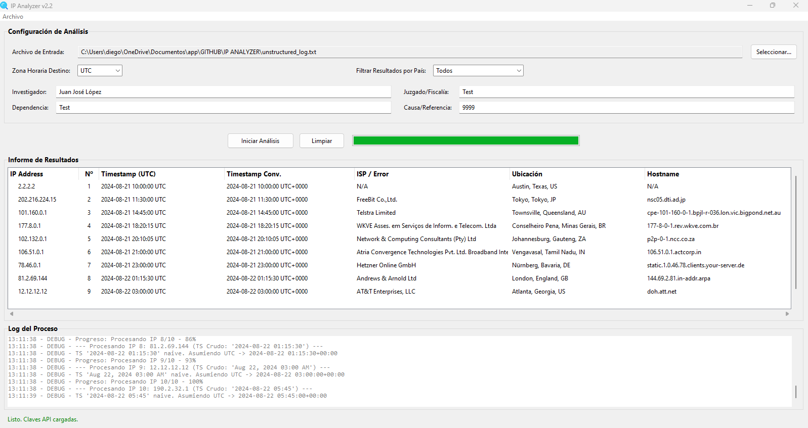
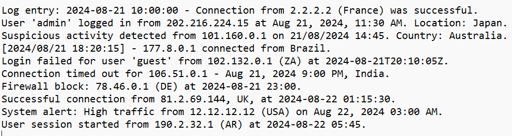
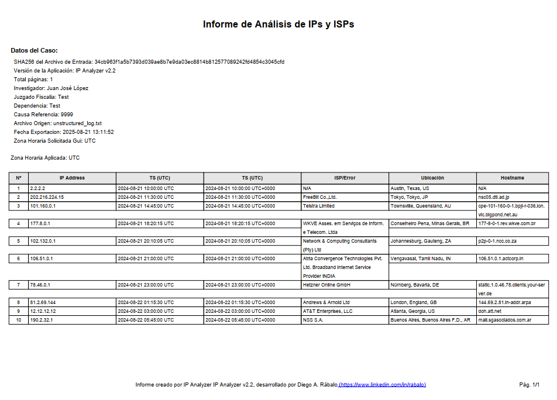

# IP Analyzer v2.2 ⚡


[](https://www.python.org/)
[](https://www.qt.io/)
[](LICENSE)

**IP Analyzer** es una solución profesional de escritorio y línea de comandos diseñada para analistas de ciberseguridad, investigadores de fuentes abiertas (OSINT) y peritos forenses digitales.

Permite la extracción, análisis, geolocalización y **detección automática de VPN/Proxy** sobre direcciones IP y marcas de tiempo (timestamps) contenidas en registros de auditoría, logs de red y documentos no estructurados.

El motor de análisis es **100% determinista, ultra rápido y de procesamiento local**, garantizando privacidad absoluta de los datos analizados sin dependencia de APIs de IA externas.

---

## 🚀 Características Destacadas

- ⚡ **Extracción Local Determinista Rápida:** Algoritmo de parseo que identifica al instante direcciones IP (IPv4 e IPv6) y sus marcas de tiempo asociadas en archivos `.txt`, `.log`, `.csv` y `.docx`.
- 🕵️ **Detección de VPN, Proxy, TOR y Datacenter:** Clasifica automáticamente si la IP corresponde a un usuario residencial real o si está enmascarada detrás de servicios VPN (NordVPN, ExpressVPN, PIA, M247, etc.), Proxies, Nodos de salida TOR o Datacenters / Cloud (AWS, Hetzner, DigitalOcean, OVH).
- 🌍 **Geolocalización e ISP:** Enriquecimiento de datos con `ipinfo.io` (ciudad, región, país, ISP y hostname). Capaz de operar en modo offline o sin token si es requerido.
- ⏰ **Conversión Universal de Zonas Horarias:** Convierte automáticamente cualquier timestamp al huso horario solicitado (UTC, UTC-3, etc.).
- 📑 **Generación de Informes Forenses:** Exportación completa a `.pdf`, `.csv`, `.json` y `.txt` con metadatos del caso (investigador, juzgado/fiscalía, causa/referencia) y hash **SHA256** del archivo original para mantener la cadena de custodia de evidencia digital.
- 🖥️ **Interfaz Gráfica Moderna (PySide6 / Qt):**
  - Área **Drag & Drop** para arrastrar archivos directamente.
  - Búsqueda global y filtrado interactivo en tiempo real por país o tipo de red.
  - Ejecución asíncrona multihilo (`QThread`) para mantener la fluidez de la interfaz.
  - Consola de logs integrada y barra de progreso.

---

## 🖼️ Capturas de Pantalla (Snapshots)

### Interfaz Gráfica Principal (PySide6 / Qt)


### Ejemplo de Archivo de Log de Entrada


### Resultados y Modelo de Informe


---

## 📋 Ejemplo de Informe Generado

```text
====================================================================================================================================================================================
                                                                 INFORME DE ANÁLISIS DE IPs, ISPs Y VPN/PRIVACIDAD
====================================================================================================================================================================================

--- Datos del Caso ---
SHA256 del Archivo de Entrada: 8a7f92b3c...1e902
Versión de la Aplicación:       IP Analyzer v2.2
Archivo Origen:                unstructured_log.txt
Investigador:                  Lic. Diego A. Rábalo
------------------------------------------------------------------------------------------------------------------------------------------------------------------------------------

                                                                      Resultados (Zona Horaria Aplicada: UTC)
------------------------------------------------------------------------------------------------------------------------------------------------------------------------------------
Nº   | IP Address                       | Timestamp (UTC)         | Timestamp (UTC)              | ISP / Error              | Tipo Red / Privacidad      | Ubicación                 | Hostname
------------------------------------------------------------------------------------------------------------------------------------------------------------------------------------
 1   | 202.216.224.15                   | 2024-08-21 11:30:00 UTC | 2024-08-21 11:30:00 UTC+0000 | FreeBit Co.,Ltd.         | Residencial / IP Real      | Tokyo, Tokyo, JP          | nsc05.dti.ad.jp
 2   | 185.220.101.5                    | 2024-08-21 12:15:00 UTC | 2024-08-21 12:15:00 UTC+0000 | M247 Europe SRL          | TOR Exit Node / VPN        | Bucharest, RO             | tor-exit-node.m247.com
 3   | 101.160.0.1                      | 2024-08-21 14:45:00 UTC | 2024-08-21 14:45:00 UTC+0000 | Telstra Limited          | Residencial / IP Real      | Townsville, AU            | cpe-101-160-0-1.bpjl...
 4   | 78.46.0.1                        | 2024-08-21 23:00:00 UTC | 2024-08-21 23:00:00 UTC+0000 | Hetzner Online GmbH      | Hosting / Datacenter       | Nürnberg, DE              | static.1.0.46.78.clie...
====================================================================================================================================================================================
```

---

## 🛠️ Instalación y Configuración

### 📦 Instalación desde Código Fuente
1. **Clonar repositorio:**
   ```bash
   git clone https://github.com/mikear/IP-Analyzer.git
   cd IP-Analyzer
   ```

2. **Crear entorno virtual:**
   ```bash
   python -m venv venv
   # En Windows:
   .\venv\Scripts\activate
   # En Linux/macOS:
   source venv/bin/activate
   ```

3. **Instalar dependencias:**
   ```bash
   pip install -r requirements.txt
   ```

### 🔑 Configuración del Token (IPInfo API)
Para habilitar el enriquecimiento de geolocalización, ISP y detección de VPN:
- Inicia la interfaz gráfica e ingresa tu token desde el menú **`Archivo > Gestionar Token IPInfo...`**.
- O bien, crea un archivo `.env` en el directorio raíz:
  ```env
  IPINFO_TOKEN=tu_token_aqui
  ```

---

## 🖥️ Modo de Uso

### Interfaz Gráfica (GUI)
```bash
python src/ip_analyzer_gui.py
```
1. Arrastra tu archivo al panel de entrada o usa el botón **"Seleccionar..."**.
2. Selecciona la zona horaria de conversión.
3. (Opcional) Ingresa metadatos del caso (Investigador, Juzgado/Fiscalía, Causa).
4. Haz clic en **"🚀 Iniciar Análisis"**.
5. Examina los resultados, busca por coincidencia o filtra por país.
6. Exporta el reporte legal desde `Archivo > Exportar Informe...` (PDF, CSV, JSON, TXT).

### Línea de Comandos (CLI)
Ideal para integración en scripts o análisis masivo:
```bash
python src/main_cli.py "C:\evidencia\log_auditoria.txt" -o "C:\informes\reporte_caso123" -tz "America/Argentina/Buenos_Aires" -m "Investigador=Diego Rabalo" -m "Causa=123/2025"
```

---

## 📄 Licencia y Créditos
- Licencia MIT.
- Desarrollado por **Diego A. Rábalo** ([LinkedIn](https://www.linkedin.com/in/rabalo)).
