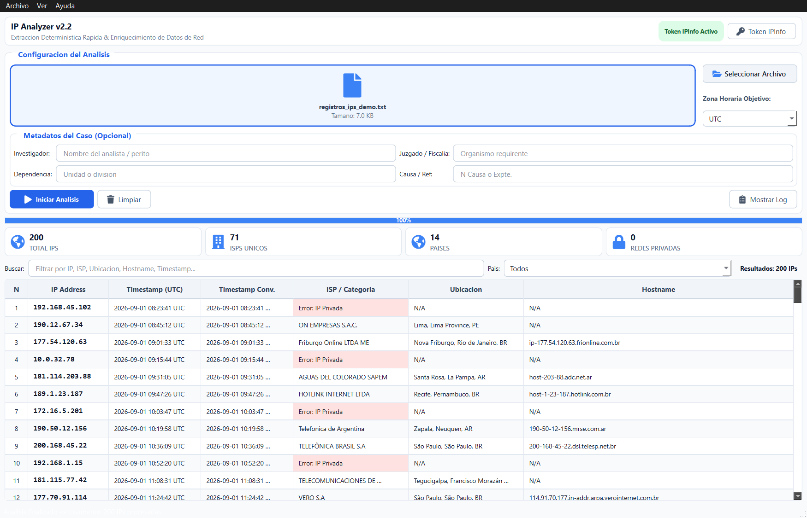

# IP Analyzer v2.2


[](https://www.python.org/)
[](https://www.qt.io/)
[](LICENSE)

**IP Analyzer** es una solucion profesional de escritorio y linea de comandos disenada para analistas de ciberseguridad, investigadores de fuentes abiertas (OSINT) y peritos forenses digitales.

Permite la extraccion, analisis y geolocalizacion de direcciones IP y marcas de tiempo (timestamps) contenidas en registros de auditoria, logs de red y documentos no estructurados.

El motor de analisis es **100% determinista, ultra rapido y de procesamiento local**, garantizando privacidad absoluta de los datos analizados sin dependencia de APIs de IA externas.

---

## Caracteristicas Destacadas

- **Extraccion Local Determinista Rapida:** Algoritmo de parseo que identifica direcciones IP (IPv4 e IPv6) y sus marcas de tiempo asociadas en archivos `.txt`, `.log`, `.csv` y `.docx`.
- **Geolocalizacion e ISP:** Enriquecimiento de datos con `ipinfo.io` (ciudad, region, pais, ISP y hostname). Capaz de operar en modo offline sin token.
- **Conversion Universal de Zonas Horarias:** Convierte automaticamente cualquier timestamp al huso horario solicitado (UTC, UTC-3, etc.).
- **Exportacion Flexible con Filtros:** Exporta el reporte legal en tres modos:
  - **Todos:** Exporta el conjunto completo de resultados.
  - **Filtrados:** Exporta solo los registros que coinciden con los filtros activos (busqueda por texto y/o pais).
  - **Seleccionados:** Exporta unicamente las filas seleccionadas manualmente en la tabla.
  - Soporta formatos `.pdf`, `.csv`, `.json` y `.txt` con metadatos del caso (investigador, juzgado/fiscalia, causa/referencia), rango de exportacion y hash **SHA256** del archivo original para mantener la cadena de custodia de evidencia digital.
- **Interfaz Grafica Moderna (PySide6 / Qt):**
  - Area **Drag & Drop** para arrastrar archivos directamente.
  - Busqueda global y filtrado interactivo en tiempo real por pais.
  - Contador de resultados visible al filtrar.
  - Ejecucion asincrona multihilo (`QThread`) para mantener la fluidez de la interfaz.
  - Consola de logs integrada y barra de progreso.
  - Iconos FontAwesome via `qtawesome` para una interfaz profesional y consistente.

---

## Capturas de Pantalla



---

## Ejemplo de Informe Generado

```text
====================================================================================================================================================================================
                                                                INFORME DE ANALISIS DE IPs Y ISPs
====================================================================================================================================================================================

--- Datos del Caso ---
SHA256 del Archivo de Entrada: 8a7f92b3c...1e902
Version de la Aplicacion:      IP Analyzer v2.2
Archivo Origen:                unstructured_log.txt
Investigador:                  Lic. Diego A. Rabalo
------------------------------------------------------------------------------------------------------------------------------------------------------------------------------------

                                                                      Resultados (Zona Horaria Aplicada: UTC)
------------------------------------------------------------------------------------------------------------------------------------------------------------------------------------
N    | IP Address                       | Timestamp (UTC)         | Timestamp (UTC)              | ISP / Error              | Ubicacion                 | Hostname
------------------------------------------------------------------------------------------------------------------------------------------------------------------------------------
 1   | 202.216.224.15                   | 2024-08-21 11:30:00 UTC | 2024-08-21 11:30:00 UTC+0000 | FreeBit Co.,Ltd.         | Tokyo, Tokyo, JP          | nsc05.dti.ad.jp
 2   | 185.220.101.5                    | 2024-08-21 12:15:00 UTC | 2024-08-21 12:15:00 UTC+0000 | M247 Europe SRL          | Bucharest, RO             | tor-exit-node.m247.com
 3   | 101.160.0.1                      | 2024-08-21 14:45:00 UTC | 2024-08-21 14:45:00 UTC+0000 | Telstra Limited          | Townsville, AU            | cpe-101-160-0-1.bpjl...
====================================================================================================================================================================================
```

---

## Instalacion y Configuracion

### Instalacion desde Codigo Fuente
1. **Clonar repositorio:**
   ```bash
   git clone https://github.com/mikear/IP-Analyzer.git
   cd IP-Analyzer
   ```

2. **Crear entorno virtual:**
   ```bash
   python -m venv venv
   # En Windows:
   .\venv\Scripts\activate
   # En Linux/macOS:
   source venv/bin/activate
   ```

3. **Instalar dependencias:**
   ```bash
   pip install -r requirements.txt
   ```

### Configuracion del Token (IPInfo API)
Para habilitar el enriquecimiento de geolocalizacion e ISP:
- Inicia la interfaz grafica e ingresa tu token desde el menu **`Archivo > Gestionar Token IPInfo...`**.
- O bien, crea un archivo `.env` en el directorio `src/`:
  ```env
  IPINFO_TOKEN=tu_token_aqui
  ```

---

## Modo de Uso

### Interfaz Grafica (GUI)
```bash
python src/ip_analyzer_gui.py
```
1. Arrastra tu archivo al panel de entrada o usa el boton **"Seleccionar Archivo"**.
2. Selecciona la zona horaria de conversion.
3. (Opcional) Ingresa metadatos del caso (Investigador, Juzgado/Fiscalia, Causa).
4. Haz clic en **"Iniciar Analisis"**.
5. Examina los resultados, busca por coincidencia o filtra por pais.
6. Exporta el reporte legal desde `Archivo > Exportar Informe...` (PDF, CSV, JSON, TXT).

### Linea de Comandos (CLI)
Ideal para integracion en scripts o analisis masivo:
```bash
python src/main_cli.py "C:\evidencia\log_auditoria.txt" -o "C:\informes\reporte_caso123" -tz "America/Argentina/Buenos_Aires" -m "Investigador=Diego Rabalo" -m "Causa=123/2025"
```

---

## Licencia y Creditos
- Licencia MIT.
- Desarrollado por **Diego A. Rabalo** ([LinkedIn](https://www.linkedin.com/in/rabalo)).
